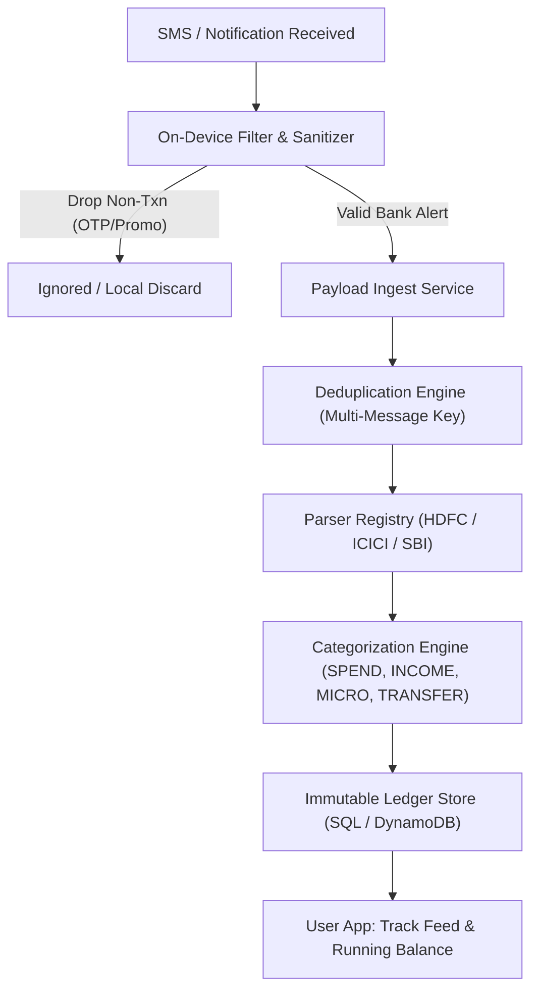

# Task 1: Product Hands-On Teardown — "Track" Flow

**Product:** Simplify Money Mobile App  
**Feature:** "Track" Flow (Automated Financial Ledger from SMS/Email alerts)  
**Author:** Dipanshu Raj (https://github.com/RjDipanshu)  

---

## 1. Executive Summary

Simplify Money's core proposition is answering the foundational question: *"Where did my money go?"* without forcing users into tedious manual expense bookkeeping. The **"Track"** flow is the operational backbone of this experience. It ingests semi-structured notification streams (SMS, notification listener, or linked email alerts), normalizes them into immutable transactional ledger records, aggregates micro-spends, and maintains running balances across multiple accounts.

This teardown examines the end-to-end journey of the Track flow: permission priming, message ingestion, parsing pipelines, deduplication edge cases, categorization heuristics, and UX presentation.

---

## 2. User Journey & Architecture Breakdown

### Stage 1: Permission Priming & Consent
- **Mechanics:** Financial tracking requires Android SMS permissions (`READ_SMS`, `RECEIVE_SMS`) or Notification Listener access.
- **Critical UX Requirement:** Users are inherently cautious about SMS access due to banking OTP fears.
- *Hands-On Observation [Insert your screenshot / observation here]:*
  > *[Placeholder: Add screenshot of the permissions priming modal in the app]*
  > *Analysis:* The app primes users before the Android system dialog appears. Effective priming should highlight: (1) We never read personal chats or store sensitive OTPs, (2) Parsing happens locally or over encrypted TLS, (3) The purpose is solely to reconstruct account ledgers.

### Stage 2: Ingestion & Filter Pipeline
- **Noise Rejection:** As experienced in the `corpus-a` benchmark:
  - Banks send promotional loan offers (`AD-HDFCBK-S: Instant personal loan of 5 Lacs...`), OTP alerts, ATM withdrawal OTPs, and delivery trackers.
  - Ingestion must cleanly reject non-transactional messages without false negatives.
- *Edge Case Handled:* E-mandate / debit mandate setups with future transaction dates or zero amounts must be parsed or safely filtered to prevent inflating current spend.

### Stage 3: Multi-Message Deduplication
- **The Problem:** When a user buys coffee via UPI, they routinely receive:
  1. Instant UPI Debit SMS (`Rs.30 debited from a/c **4821...`)
  2. Bank Email alert (`Dear Customer, INR 30.00 debited...`)
  3. UPI app push notification.
- **The Fix:** Deduplication cannot rely on message ID. It requires a synthetic correlation key:
  `{account_last4} : {date_minute_bucket} : {amount} : {direction}`
  Evidence from multiple channels must be merged into one ledger record with all `source_message_ids` retained for auditability.

### Stage 4: Financial Categorisation Heuristics
- **`MICRO` (<= ₹100 UPI debits):** Rolled up into aggregate totals rather than cluttering the primary transaction feed. This dramatically reduces cognitive overload for users making 5-10 small UPI purchases daily (tea, auto, groceries).
- **`TRANSFER` (Inter-account movements):** Debiting Account A (e.g., HDFC 4821) and crediting Account B (e.g., ICICI 9075) must be correlated. Counting both inflates both Spend and Income.
- **`SPEND` & `INCOME`:** Net outflows and inflows that accurately shift net worth.

---

## 3. Friction Points & Edge Cases Identified

| Friction Point | Impact | Root Cause & Recommended Mitigation |
|----------------|--------|--------------------------------------|
| **Missing Bank SMS (Silent Drops)** | Ledger balances diverge from bank app | Telecoms drop SMS, or bank fails to send alert for small ATM/offline debits (e.g. ₹7,500 drop on account 4821). Solution: Detect stated balance jumps and flag un-alerted drops in a Reconciliation view. |
| **Whole-Rupee Regex Pitfall** | Critical incident INC-2026-09-11 | Regex requiring `.00` misses `Rs.5` and grabs the adjacent `Avl Bal: Rs.92,213.10`. Solution: Strict non-greedy amount extractors with optional cents and trailing delimiter guards. |
| **Notification Delay vs. Actual Txn Time** | Txns displayed out of order | SMS arrives minutes or hours late due to roaming or network latency. Ingestion must parse the *in-body transaction timestamp*, not rely on `received_at`. |
| **Shared Accounts / Multiple Cards** | Mixed credit card and savings alerts | A single user profile may track credit card statements (e.g. CC 3310) alongside savings accounts. Clear account labeling in the UI is essential. |

---

## 4. Architectural Recommendations for Scale

1. **On-Device Hybrid Parsing vs. Cloud Processing:**
   - On-device regex matching ensures zero sensitive OTP transmission to servers, maximizing user trust.
   - Cloud pipeline handles complex NLP merchant cleaning (e.g., mapping `UPI/PYTM*SWIGGY` to `Swiggy`) and inter-device sync.
2. **Reconciliation as a First-Class Feature:**
   - Whenever an SMS carries `Avl Bal: Rs.X`, the backend should compare `computed_balance` with `stated_balance`.
   - Any gap should be surfaced to the user cleanly: *"We noticed a ₹7,500 withdrawal on 29 July not captured in SMS. Would you like to tag this?"* This turns an unavoidable bank data limitation into a trust-building feature.
3. **Single-Table Query Optimization:**
   - As implemented in the ledger migration, partition by `{Account}#{Month}` to guarantee $O(1)$ scans for the monthly feed, avoiding slow full-table scans.

---

## 5. Mobile App Hands-On Screenshots & Walkthrough

> *[Attach 2-3 screenshots of your personal walk through the Simplify Money app here]*
> 
> - **Figure 1:** *Onboarding and permission priming screen.*
> - **Figure 2:** *Transaction feed showing classified spends and micro-transactions.*
> - **Figure 3:** *Account overview displaying balance tracking.*

---
